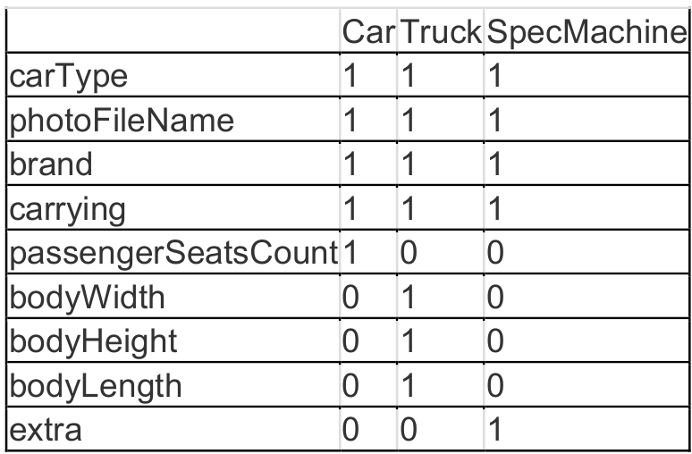

Предположим есть данные о разных автомобилях и спецтехнике.
Данные представлены в виде таблицы с характеристиками. Обратите
внимание на то, что некоторые колонки присущи только легковым
автомобилям, например, кол-во пассажирских мест. В свою очередь
только у грузовых автомобилей есть длина, ширина и высота кузова.

Вам необходимо создать свою иерархию классов для данных, которые
описаны в таблице.
BaseCar
Car extends BaseCar
Truck extends BaseCar
SpecMachine extends BaseCar
У любого объекта есть обязательный атрибут carType. Он означает
тип объекта и может принимать одно из значений: car, truck,
specMachine.
Также у любого объекта из иерархии есть фото в виде имени файла
— обязательный атрибут photoFileName.
Для грузового автомобиля необходимо разделить характеристики
кузова на отдельные составляющие bodyLength, bodyWidth,
bodyHeight. Разделитель — латинская буква x. Характеристики кузова
могут быть заданы в виде пустой строки, в таком случае все
составляющие равны 0. Обратите внимание на то, что характеристики
кузова должны быть вещественными числами.
Также для класса грузового автомобиля необходимо реализовать
метод getBodyVolume, возвращающий объем кузова в метрах
кубических.Все обязательные атрибуты для объектов Car, Truck и SpecMachine
перечислены в таблице ниже, где 1 - означает, что атрибут
обязателен для объекта, 0 - атрибут должен отсутствовать.

Далее необходимо реализовать функцию, на вход которой подается
имя файла в формате csv. Файл содержит данные аналогичны
строкам из таблицы. Вам необходимо прочитать этот файл построчно.
Затем проанализировать строки и создать список нужных объектов с
автомобилями и специальной техникой. Функция должна возвращать
список объектов.
Не важно как вы назовете свои классы, главное чтобы их атрибуты
имели имена:
• carType
• brand
• passengerSeatsCount
• photoFileName
• bodyWidth
• bodyHeight
• bodyLength
• carrying
• extra
И методы:
getPhotoFileExt и getBodyVolume
Метод getPhotoFileExt возвращает расширение файла (“.png”, “.jpeg” и
т.д.) с фото.
У каждого объекта из иерархии должен быть свой набор атрибутов и
методов. У класса легковой автомобиль не должно быть метода
getBodyVolume в отличие от класса грузового автомобиля.Функция, которая парсит строки входного массива, должна называться
getCarList. Для проверки работы своей реализации функции getCarList
и всех созданных классов вам необходимо использовать csv-файл,
который прилагается к заданию.
Первая строка в исходном файле — это заголовок csv, который
содержит имена колонок. Нужно пропустить первую строку из
исходного файла. Обратите внимание на то, что исходный файл с
данными содержит некорректные строки, которые нужно пропустить.
Если возникают исключения в процессе создания объектов из строк
csv-файла, то требуется их корректно обработать стандартным
способом.
Также обратите внимание, что все значения в csv файле при чтении
будут строками. Нужно преобразовать строку в int для
passengerSeatsCount, во float для carrying, а также во float для
bodyWidth bodyHeight, bodyLength.
Также ваша программа должна быть готова к тому, что в некоторых
строках данные могут быть заполнены некорректно. Например, число
колонок меньше . В таком случае нужно проигнорировать подобные
строки и не создавать объекты. Строки с пустым значением для
bodyWhl игнорироваться не должны. Вы можете использовать
механизм исключений для обработки ошибок.
Вам необходимо реализовать функционал классов и функцию
getCarList.